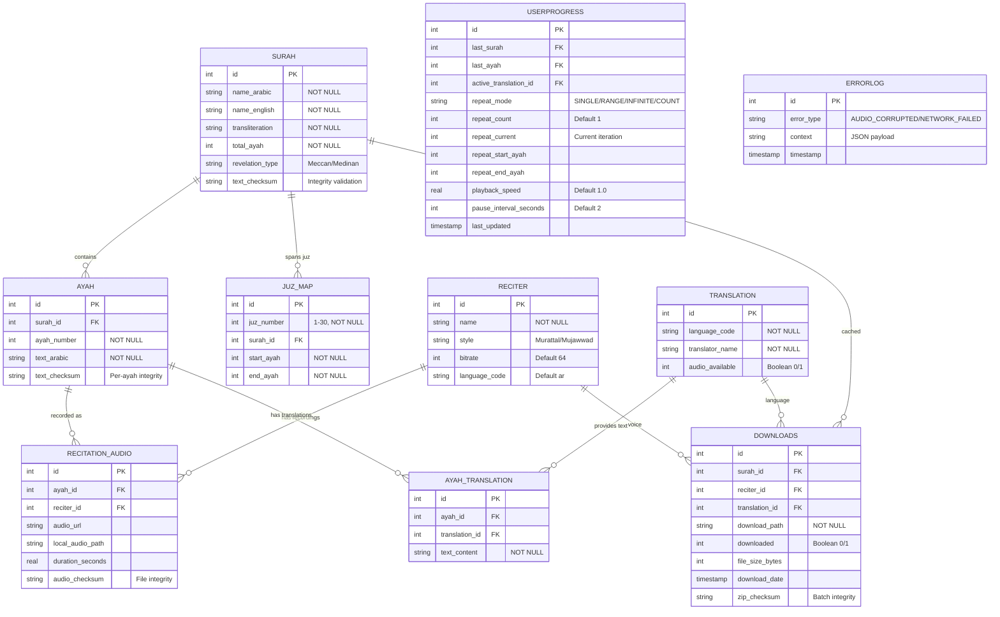

# ER Diagram — Database Model V3 (Corrected)

## Entity Relationship Diagram



---

## SQL Schema Definitions

### Surah Table
```sql
CREATE TABLE Surah (
  id INTEGER PRIMARY KEY,
  name_arabic TEXT NOT NULL,
  name_english TEXT NOT NULL,
  transliteration TEXT NOT NULL,
  total_ayah INTEGER NOT NULL,
  revelation_type TEXT CHECK(revelation_type IN ('Meccan', 'Medinan')),
  text_checksum TEXT NOT NULL
);
```

### Ayah Table (Text Only - Normalized)
```sql
CREATE TABLE Ayah (
  id INTEGER PRIMARY KEY,
  surah_id INTEGER NOT NULL,
  ayah_number INTEGER NOT NULL,
  text_arabic TEXT NOT NULL,
  text_checksum TEXT NOT NULL,
  FOREIGN KEY (surah_id) REFERENCES Surah(id) ON DELETE CASCADE,
  UNIQUE(surah_id, ayah_number)
);

CREATE INDEX idx_ayah_lookup ON Ayah(surah_id, ayah_number);
```

### Juz Map Table (NEW - Enables "Play Juz 3")
```sql
CREATE TABLE JuzMap (
  id INTEGER PRIMARY KEY,
  juz_number INTEGER NOT NULL CHECK(juz_number BETWEEN 1 AND 30),
  surah_id INTEGER NOT NULL,
  start_ayah INTEGER NOT NULL,
  end_ayah INTEGER NOT NULL,
  FOREIGN KEY (surah_id) REFERENCES Surah(id) ON DELETE CASCADE
);

CREATE INDEX idx_juz_lookup ON JuzMap(juz_number);
CREATE INDEX idx_juz_surah ON JuzMap(surah_id);

-- Example data: Juz 3 spans Surahs 2 (Baqarah) and 3 (Ali-Imran)
INSERT INTO JuzMap (juz_number, surah_id, start_ayah, end_ayah) VALUES
  (3, 2, 253, 286),  -- Baqarah 253-286
  (3, 3, 1, 92);     -- Ali-Imran 1-92
```

**Query for "Play Juz 3":**
```sql
SELECT surah_id, start_ayah, end_ayah 
FROM JuzMap 
WHERE juz_number = 3 
ORDER BY surah_id, start_ayah;
```

### Reciter Table
```sql
CREATE TABLE Reciter (
  id INTEGER PRIMARY KEY,
  name TEXT NOT NULL,
  style TEXT,
  bitrate INTEGER DEFAULT 64,
  language_code TEXT DEFAULT 'ar'
);
```

### Recitation Audio Table (Normalized - Separate from Ayah)
```sql
CREATE TABLE RecitationAudio (
  id INTEGER PRIMARY KEY,
  ayah_id INTEGER NOT NULL,
  reciter_id INTEGER NOT NULL,
  audio_url TEXT,
  local_audio_path TEXT,
  duration_seconds REAL,
  audio_checksum TEXT,
  FOREIGN KEY (ayah_id) REFERENCES Ayah(id) ON DELETE CASCADE,
  FOREIGN KEY (reciter_id) REFERENCES Reciter(id) ON DELETE SET NULL,
  UNIQUE(ayah_id, reciter_id)
);

CREATE INDEX idx_recitation_lookup ON RecitationAudio(ayah_id, reciter_id);
```

**Why Normalized:**
- Supports multiple reciters per Ayah
- Allows switching reciters without re-downloading text
- Audio and text lifecycles are independent

### Translation Table
```sql
CREATE TABLE Translation (
  id INTEGER PRIMARY KEY,
  language_code TEXT NOT NULL,
  translator_name TEXT NOT NULL,
  audio_available INTEGER DEFAULT 0
);
```

### Ayah Translation Table (NEW - Normalized)
```sql
CREATE TABLE AyahTranslation (
  id INTEGER PRIMARY KEY,
  ayah_id INTEGER NOT NULL,
  translation_id INTEGER NOT NULL,
  text_content TEXT NOT NULL,
  FOREIGN KEY (ayah_id) REFERENCES Ayah(id) ON DELETE CASCADE,
  FOREIGN KEY (translation_id) REFERENCES Translation(id) ON DELETE CASCADE,
  UNIQUE(ayah_id, translation_id)
);

CREATE INDEX idx_translation_lookup ON AyahTranslation(ayah_id, translation_id);
```

**Benefits:**
- Switch translations instantly (no UPDATE queries)
- Support multiple simultaneous translations
- Add new translations without schema changes

**Query for Ayah with Translation:**
```sql
SELECT 
  a.text_arabic,
  at.text_content AS translation
FROM Ayah a
LEFT JOIN AyahTranslation at ON a.id = at.ayah_id
WHERE a.surah_id = 1 
  AND a.ayah_number = 1
  AND at.translation_id = 2;  -- Sahih International
```

### Downloads Table (Batch-oriented)
```sql
CREATE TABLE Downloads (
  id INTEGER PRIMARY KEY,
  surah_id INTEGER NOT NULL,
  reciter_id INTEGER NOT NULL,
  translation_id INTEGER,
  download_path TEXT NOT NULL,  -- Path to extracted folder
  downloaded INTEGER DEFAULT 0,
  file_size_bytes INTEGER,
  download_date TIMESTAMP,
  zip_checksum TEXT,  -- Checksum of downloaded ZIP
  FOREIGN KEY (surah_id) REFERENCES Surah(id) ON DELETE CASCADE,
  FOREIGN KEY (reciter_id) REFERENCES Reciter(id) ON DELETE SET NULL,
  FOREIGN KEY (translation_id) REFERENCES Translation(id) ON DELETE SET NULL,
  UNIQUE(surah_id, reciter_id, translation_id)
);

CREATE INDEX idx_downloads_status ON Downloads(surah_id, downloaded);
```

### User Progress Table
```sql
CREATE TABLE UserProgress (
  id INTEGER PRIMARY KEY,
  last_surah INTEGER,
  last_ayah INTEGER,
  active_translation_id INTEGER,  -- Current translation preference
  repeat_mode TEXT CHECK(repeat_mode IN ('SINGLE', 'RANGE', 'INFINITE', 'COUNT')),
  repeat_count INTEGER DEFAULT 1,
  repeat_current INTEGER DEFAULT 0,
  repeat_start_ayah INTEGER,
  repeat_end_ayah INTEGER,
  playback_speed REAL DEFAULT 1.0,
  pause_interval_seconds INTEGER DEFAULT 2,
  last_updated TIMESTAMP DEFAULT CURRENT_TIMESTAMP,
  FOREIGN KEY (last_surah) REFERENCES Surah(id),
  FOREIGN KEY (active_translation_id) REFERENCES Translation(id)
);
```

### Error Log Table
```sql
CREATE TABLE ErrorLog (
  id INTEGER PRIMARY KEY,
  error_type TEXT NOT NULL,
  context TEXT,
  timestamp TIMESTAMP DEFAULT CURRENT_TIMESTAMP
);

CREATE INDEX idx_error_type ON ErrorLog(error_type);
```

---

## Data Integrity Triggers

### Prevent Quran Text Modification
```sql
CREATE TRIGGER prevent_quran_modification
BEFORE UPDATE OF text_arabic ON Ayah
BEGIN
  SELECT RAISE(ABORT, 'Quran text cannot be modified');
END;

CREATE TRIGGER prevent_translation_modification
BEFORE UPDATE OF text_content ON AyahTranslation
BEGIN
  SELECT RAISE(ABORT, 'Translation text cannot be modified');
END;
```

### Validate Ayah Number
```sql
CREATE TRIGGER validate_ayah_number
BEFORE INSERT ON Ayah
BEGIN
  SELECT CASE
    WHEN NEW.ayah_number > (SELECT total_ayah FROM Surah WHERE id = NEW.surah_id)
    THEN RAISE(ABORT, 'Ayah number exceeds Surah total')
  END;
END;
```

### Validate Repeat Range
```sql
CREATE TRIGGER validate_repeat_range
BEFORE UPDATE ON UserProgress
BEGIN
  SELECT CASE
    WHEN NEW.repeat_end_ayah IS NOT NULL 
      AND NEW.repeat_start_ayah IS NOT NULL
      AND NEW.repeat_end_ayah < NEW.repeat_start_ayah
    THEN RAISE(ABORT, 'Invalid repeat range: end < start')
  END;
END;
```

### Validate Juz Boundaries
```sql
CREATE TRIGGER validate_juz_boundaries
BEFORE INSERT ON JuzMap
BEGIN
  SELECT CASE
    WHEN NEW.end_ayah < NEW.start_ayah
    THEN RAISE(ABORT, 'Invalid Juz range: end < start')
    WHEN NEW.end_ayah > (SELECT total_ayah FROM Surah WHERE id = NEW.surah_id)
    THEN RAISE(ABORT, 'Juz end_ayah exceeds Surah total')
  END;
END;
```

---

## Query Performance Optimization

### Common Queries with Indexes

**1. Get Ayah with Translation:**
```sql
-- Uses: idx_ayah_lookup, idx_translation_lookup
SELECT 
  s.name_arabic AS surah_name,
  a.text_arabic,
  at.text_content AS translation
FROM Ayah a
JOIN Surah s ON a.surah_id = s.id
LEFT JOIN AyahTranslation at ON a.id = at.ayah_id
WHERE a.surah_id = ? 
  AND a.ayah_number = ?
  AND at.translation_id = ?;
```

**2. Get Audio Path for Ayah:**
```sql
-- Uses: idx_recitation_lookup
SELECT local_audio_path, duration_seconds
FROM RecitationAudio
WHERE ayah_id = (
  SELECT id FROM Ayah 
  WHERE surah_id = ? AND ayah_number = ?
)
AND reciter_id = ?;
```

**3. Get All Ayahs in Juz:**
```sql
-- Uses: idx_juz_lookup
SELECT a.id, a.surah_id, a.ayah_number, a.text_arabic
FROM JuzMap jm
JOIN Ayah a ON a.surah_id = jm.surah_id
WHERE jm.juz_number = ?
  AND a.ayah_number BETWEEN jm.start_ayah AND jm.end_ayah
ORDER BY jm.surah_id, a.ayah_number;
```

**4. Check Download Status:**
```sql
-- Uses: idx_downloads_status
SELECT downloaded, download_path
FROM Downloads
WHERE surah_id = ? 
  AND reciter_id = ?
  AND (translation_id = ? OR translation_id IS NULL);
```

**5. Switch Translation (No Updates Needed):**
```sql
-- Just update user preference
UPDATE UserProgress 
SET active_translation_id = ? 
WHERE id = 1;

-- Fetch uses new translation_id automatically
```

---

## Storage Estimates

### Per Surah (Average)
- **Text data:** ~10 KB (Arabic + metadata)
- **Audio (64kbps MP3):** 5-15 MB per reciter
- **Translation text:** ~5 KB per language
- **Translation audio:** 3-10 MB per language (if available)

### Full Quran
- **Database (all tables):** ~50 MB
- **Arabic audio (1 reciter):** ~1-2 GB
- **+ English translation audio:** +800 MB
- **Total (minimal):** ~2-3 GB

### Compression for Downloads
- **ZIP ratio:** ~70% (MP3 already compressed, but metadata/text compress well)
- **Average Surah ZIP:** 8-10 MB (vs 12-15 MB uncompressed)

---

## Migration from V2 to V3

If you have existing V2 databases, run this migration:

```sql
-- 1. Create new tables
CREATE TABLE JuzMap (...);
CREATE TABLE RecitationAudio (...);
CREATE TABLE AyahTranslation (...);

-- 2. Migrate audio data
INSERT INTO RecitationAudio (ayah_id, reciter_id, audio_url, local_audio_path, duration_seconds, audio_checksum)
SELECT a.id, 1, a.audio_url, a.local_audio_path, a.duration_seconds, a.audio_checksum
FROM Ayah a
WHERE a.audio_url IS NOT NULL OR a.local_audio_path IS NOT NULL;

-- 3. Migrate translation text
INSERT INTO AyahTranslation (ayah_id, translation_id, text_content)
SELECT a.id, 1, a.text_translation
FROM Ayah a
WHERE a.text_translation IS NOT NULL;

-- 4. Drop old columns
ALTER TABLE Ayah DROP COLUMN audio_url;
ALTER TABLE Ayah DROP COLUMN local_audio_path;
ALTER TABLE Ayah DROP COLUMN duration_seconds;
ALTER TABLE Ayah DROP COLUMN audio_checksum;
ALTER TABLE Ayah DROP COLUMN text_translation;

-- 5. Load Juz data (from Tanzil or similar source)
-- ... (30 rows total)
```

---

## Schema Benefits Summary

| Feature | V2 (Old) | V3 (New) | Benefit |
|---------|----------|----------|---------|
| Multi-reciter support | No | Yes | Users can switch reciters without re-downloading text |
| Multi-translation support | No (single column) | Yes (normalized) | Instant translation switching, no UPDATE queries |
| Juz navigation | Complex SQL | Simple query | "Play Juz 3" is a single indexed lookup |
| Storage efficiency | N/A | ZIP batches | 30% smaller downloads, atomic integrity |
| Schema flexibility | Rigid | Extensible | Add reciters/translations without schema changes |

---

END OF ER DIAGRAM V3
