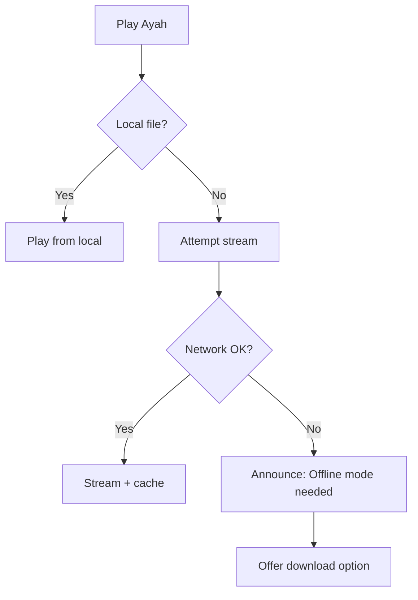
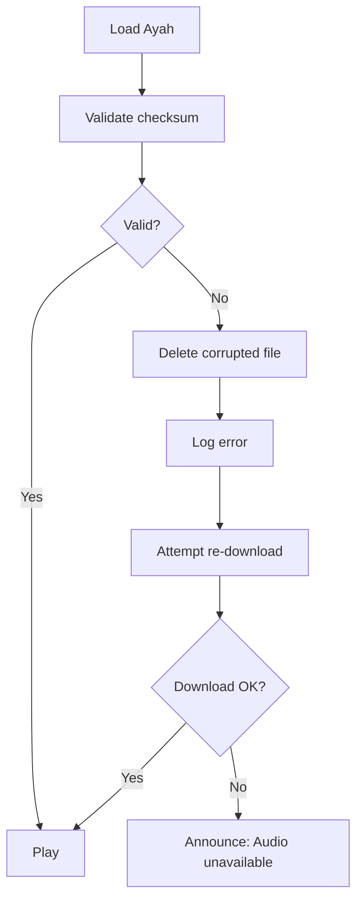
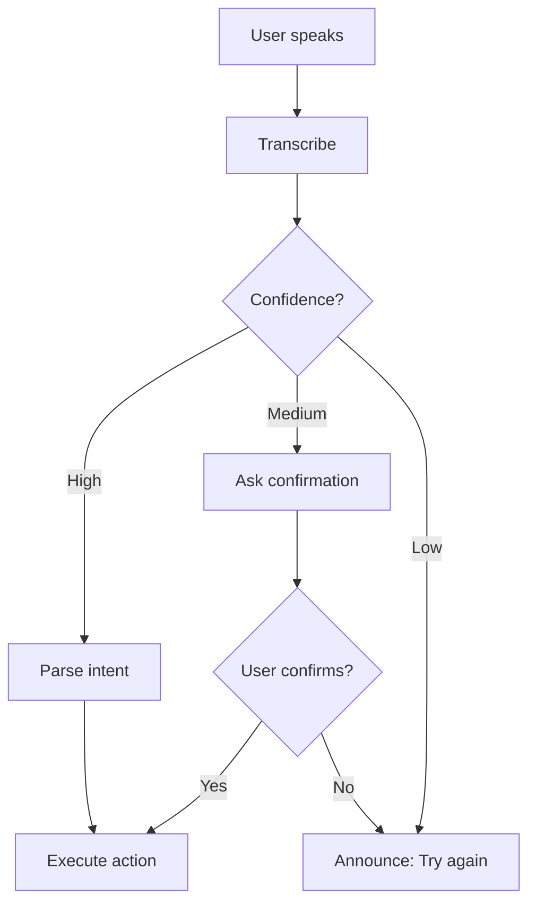
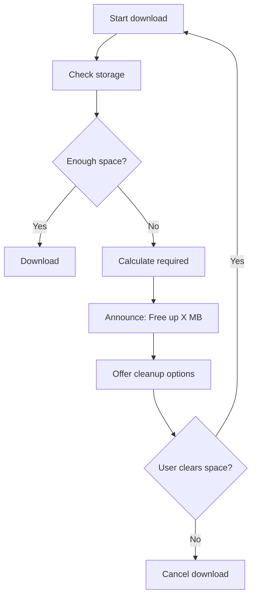

# Quran App for Blind Users — FULL GRANULAR TECHNICAL SPEC (Version 3)

Author: Accessibility‑First Build Spec  
Purpose: Agent‑Executable Documentation  
Scope: MVP → Scalable Architecture  
**NEW: C++ Native Module Integration**

---

# 0. PRODUCT INTENTION

Accessibility‑first Quran application designed for blind and visually impaired users focusing on:

• Voice‑first navigation  
• Ayah‑level memorization workflows  
• Offline ibadah usability  
• Native language expansion  
• Distraction‑free spiritual environment  

---

# 1. SYSTEM ARCHITECTURE OVERVIEW

**Frontend:** Flutter  
**Native Layer:** C++ (audio engine, phonetic matching, validation)  
**Audio Engine:** just_audio + audio_service (Flutter) + Oboe (C++ native for Android)  
**Speech Layer:** speech_to_text  
**Database:** SQLite  
**Storage:** Local file system (Ayah level MP3)  
**API Source:** Quran.com + EveryAyah  
**Text Source:** Tanzil

**Architecture Model:** Offline‑First with Streaming Fallback

## C++ Native Modules

```
/native/
  ├── audio_engine/       # Low-latency audio processing
  ├── phonetic_matcher/   # Fuzzy string matching
  ├── integrity_validator/ # Audio/text checksums
  └── ffi_bridge/         # Dart FFI bindings
```

**Why C++:**
- Sub-10ms audio seek latency (critical for memorization loops)
- Faster phonetic matching (Levenshtein distance)
- Hardware-accelerated audio processing
- Shared codebase potential for iOS/Android

---

# 2. FULL DATABASE SCHEMA

## Surah
```sql
CREATE TABLE Surah (
  id INTEGER PRIMARY KEY,
  name_arabic TEXT NOT NULL,
  name_english TEXT NOT NULL,
  transliteration TEXT NOT NULL,
  total_ayah INTEGER NOT NULL,
  juz_start INTEGER,
  juz_end INTEGER,
  revelation_type TEXT, -- 'Meccan' or 'Medinan'
  checksum TEXT NOT NULL -- Integrity validation
);
```

## Ayah
```sql
CREATE TABLE Ayah (
  id INTEGER PRIMARY KEY,
  surah_id INTEGER NOT NULL,
  ayah_number INTEGER NOT NULL,
  text_arabic TEXT NOT NULL,
  text_translation TEXT,
  audio_url TEXT,
  local_audio_path TEXT,
  duration_seconds REAL,
  audio_checksum TEXT, -- File integrity
  FOREIGN KEY (surah_id) REFERENCES Surah(id),
  UNIQUE(surah_id, ayah_number)
);

CREATE INDEX idx_ayah_lookup ON Ayah(surah_id, ayah_number);
```

## Reciter
```sql
CREATE TABLE Reciter (
  id INTEGER PRIMARY KEY,
  name TEXT NOT NULL,
  style TEXT, -- 'Murattal', 'Mujawwad', etc.
  bitrate INTEGER DEFAULT 64,
  base_audio_url TEXT NOT NULL,
  language_code TEXT DEFAULT 'ar'
);
```

## Translation
```sql
CREATE TABLE Translation (
  id INTEGER PRIMARY KEY,
  language_code TEXT NOT NULL,
  translator_name TEXT NOT NULL,
  audio_available INTEGER DEFAULT 0, -- Boolean
  base_url TEXT
);
```

## UserProgress
```sql
CREATE TABLE UserProgress (
  id INTEGER PRIMARY KEY,
  last_surah INTEGER,
  last_ayah INTEGER,
  repeat_mode TEXT, -- 'SINGLE', 'RANGE', 'INFINITE', 'COUNT'
  repeat_count INTEGER DEFAULT 1,
  repeat_current INTEGER DEFAULT 0, -- Current repeat iteration
  repeat_start_ayah INTEGER,
  repeat_end_ayah INTEGER,
  playback_speed REAL DEFAULT 1.0,
  pause_interval_seconds INTEGER DEFAULT 2,
  last_updated TIMESTAMP DEFAULT CURRENT_TIMESTAMP,
  FOREIGN KEY (last_surah) REFERENCES Surah(id)
);
```

## Downloads
```sql
CREATE TABLE Downloads (
  id INTEGER PRIMARY KEY,
  surah_id INTEGER NOT NULL,
  reciter_id INTEGER NOT NULL,
  translation_id INTEGER,
  download_path TEXT NOT NULL,
  downloaded INTEGER DEFAULT 0,
  file_size_bytes INTEGER,
  download_date TIMESTAMP,
  checksum TEXT, -- Verify integrity
  FOREIGN KEY (surah_id) REFERENCES Surah(id),
  FOREIGN KEY (reciter_id) REFERENCES Reciter(id),
  FOREIGN KEY (translation_id) REFERENCES Translation(id),
  UNIQUE(surah_id, reciter_id, translation_id)
);
```

## ErrorLog
```sql
CREATE TABLE ErrorLog (
  id INTEGER PRIMARY KEY,
  error_type TEXT NOT NULL, -- 'AUDIO_CORRUPTED', 'NETWORK_FAILED', etc.
  context TEXT, -- JSON payload
  timestamp TIMESTAMP DEFAULT CURRENT_TIMESTAMP
);
```

---

# 3. FOLDER STORAGE STRUCTURE

```
/QuranApp/
 ├── audio/
 │   └── reciters/
 │       └── {reciter_id}/
 │           └── {surah_id}/
 │               ├── 001.mp3  # Ayah 1
 │               ├── 002.mp3
 │               └── ...
 ├── translations/
 │   └── {lang_code}/
 │       └── {surah_id}/
 │           └── {ayah}.mp3
 ├── cache/
 │   ├── metadata.json
 │   └── thumbnails/ (for future visual mode)
 ├── native_libs/
 │   ├── libphonetic.so (Android)
 │   └── libphonetic.dylib (iOS)
 └── quran.db
```

**Design Principle:** Ayah‑level files for instant repeat + seek.

**Storage Quota Handling:**
- Alert at 80% capacity
- Auto-cleanup of oldest cached streams
- User-configurable max storage

---

# 4. UI SCREEN FLOW + AUDIO STATE MODEL

## State Machine

```
┌─────────┐
│  IDLE   │──────┐
└─────────┘      │
     │           │
     ▼           │
┌─────────┐      │
│ LOADING │──────┤ (Error)
└─────────┘      │
     │           │
     ▼           │
┌─────────┐      │
│ PLAYING │◄─────┘
└─────────┘
     │
     ▼
┌─────────┐     ┌──────────┐
│ PAUSED  │────►│ REPEATING│
└─────────┘     └──────────┘
     │               │
     └───────┬───────┘
             ▼
        ┌─────────┐
        │ STOPPED │
        └─────────┘
```

## Splash
**Audio:** "Assalamu Alaikum. Quran app ready."  
**Haptic:** Single short vibration (optional)

## Home
Options read sequentially:
• Resume playback  
• Browse Surahs  
• Downloads  
• Settings  

**Gestures:**
- Swipe right: Next option
- Swipe left: Previous option
- Double tap: Select
- Two-finger swipe down: Global pause/play

## Surah List
Each item announced:
"Surah Rahman. 78 Ayahs. Meccan."

**Accessibility:**
- Each Surah is a focusable element
- Custom accessibility label includes full context
- Avoids "button" suffix confusion

## Player Screen
**Audio states announced:**
• Surah name  
• Ayah number  
• Playback status  
• Repeat mode (if active)
• Translation status  

**Gesture Map:**
- Swipe up: Next Ayah
- Swipe down: Previous Ayah
- Two-finger tap: Toggle repeat mode
- Three-finger swipe right: Speed up
- Three-finger swipe left: Speed down

**Screen Reader Priority:**
Voice commands take precedence over screen reader.
Audio ducking: Screen reader volume reduces to 30% during Quran playback.

## Repeat Setup
Voice guided prompts:
"Single Ayah or range?"

**If range:**
"Starting Ayah number?"
"Ending Ayah number?"
"How many times? Say infinite for continuous loop."

## Downloads
Offline availability announcements.
"Surah Baqarah. 45 of 286 Ayahs downloaded."

**Navigation Depth Rule:** Max 2 levels from home.

---

# 5. AUDIO ENGINE DESIGN

## Architecture

```
┌─────────────────────────────────────┐
│       Flutter UI Layer              │
└─────────────────────────────────────┘
              │ (Method Channel)
┌─────────────────────────────────────┐
│     Audio Service (Background)      │
│  ┌──────────────────────────────┐   │
│  │   Playback Controller        │   │
│  └──────────────────────────────┘   │
│  ┌──────────────────────────────┐   │
│  │   C++ Audio Engine (FFI)     │   │
│  │   - Oboe (Android)           │   │
│  │   - AVAudioEngine (iOS)      │   │
│  └──────────────────────────────┘   │
└─────────────────────────────────────┘
              │
      ┌───────┴───────┐
      ▼               ▼
  Local Files    Network Stream
```

## Playback Modes

**Offline Local:**
- C++ native decoder
- Sub-5ms seek latency
- Gapless Ayah transitions

**Streaming:**
- Progressive download
- Adaptive bitrate fallback
- Auto-cache frequently accessed

**Hybrid Fallback:**
```
1. Check local file existence
2. If missing → Stream + queue for download
3. If corrupted → Re-download + log error
4. Network fail → Audio feedback "Offline mode required"
```

## Capabilities

**Ayah Seek:**
- Jump to specific Ayah in <10ms
- Preload next Ayah during current playback (buffer +1)

**Range Loop:**
- Configurable pause between repeats (1s–5s)
- Visual + audio countdown timer during pause

**Speed Control:**
- 0.5x to 2.0x in 0.25x increments
- Pitch preservation using WSOLA algorithm (C++ native)

**Background Playback:**
- MediaSession integration (Android)
- Control Center support (iOS)
- Lock screen controls with Ayah info

## Buffer Strategy

```cpp
// Preload next Ayah during playback
void AudioEngine::onPlaybackProgress(double position) {
  if (position > currentAyah.duration * 0.8) {
    preloadAyah(currentAyah.number + 1);
  }
}
```

## Audio Interruption Handling

**Phone Call:**
```
1. Duck audio to 0%
2. Pause playback
3. Save exact position + repeat state
4. On call end → Resume from saved position
```

**Notification:**
```
1. Duck Quran audio to 70%
2. Play notification
3. Restore to 100%
```

**Other Audio App:**
```
1. Request audio focus
2. If denied → Pause and show notification
3. If granted → Resume playback
```

---

# 6. MEMORIZATION ENGINE LOGIC

## Repeat Types

**1. Single Ayah Loop**
```
Play Ayah → Pause (configurable) → Repeat → Count--
```

**2. Range Loop**
```
Play Ayah 1 → Ayah 2 → ... → Ayah N → Pause → Repeat all
```

**3. Infinite Loop**
```
Play → Pause → Repeat (no count limit)
User must manually stop
```

**4. Count Loop**
```
Play → Pause → Repeat × N times → Auto-stop + notification
```

## Auto Pause Configuration

**User adjustable:**
- 1 second (fast review)
- 2 seconds (default)
- 3 seconds (breathing room)
- 5 seconds (reflection time)

**Countdown Audio:**
"Repeating in 3... 2... 1..."

## State Preservation

**On app restart:**
```sql
SELECT repeat_mode, repeat_current, repeat_count 
FROM UserProgress 
WHERE id = 1;
```

**Resume prompt:**
"You were repeating Ayah 5 of Surah Baqarah. Continue?"

## Edge Cases

**Surah switch during repeat:**
```
1. Save current repeat state
2. Announce: "Repeat cancelled. Switching Surah."
3. Clear repeat mode
```

**Audio error during repeat:**
```
1. Log error
2. Pause repeat
3. Announce: "Audio unavailable. Check downloads."
4. Offer: "Try different reciter?" or "Download now?"
```

---

# 7. VOICE INTENT ARCHITECTURE

## Pipeline

```
Speech → Transcription → Intent Parser → Parameter Extractor → Action → Audio Feedback
```

## Intent Definitions

### PlaySurahIntent
**Examples:**
- "Play Surah Rahman"
- "Start Surah Al-Baqarah"
- "Begin Al-Fatiha"

**Parameters:**
- surah_name (fuzzy matched)

**Action:**
```dart
void executePlaysIntent(String surahName) {
  int? surahId = phoneticMatcher.findSurah(surahName);
  if (surahId != null) {
    audioEngine.playSurah(surahId);
    announce("Playing Surah ${surahName}");
  } else {
    announce("Surah not found. Please try again.");
  }
}
```

### GoToAyahIntent
**Examples:**
- "Go to Ayah 10"
- "Jump to verse 25"
- "Ayah number 5"

**Parameters:**
- ayah_number (integer)

**Validation:**
- Check if ayah_number <= current_surah.total_ayah

### RepeatIntent
**Examples:**
- "Repeat this Ayah"
- "Repeat Ayah 5 to 10"
- "Loop this verse 7 times"
- "Repeat infinitely"

**Parameters:**
- repeat_mode: SINGLE | RANGE | INFINITE | COUNT
- start_ayah (optional)
- end_ayah (optional)
- count (optional)

### TranslationIntent
**Examples:**
- "Enable Urdu translation"
- "Play English translation"
- "Turn off translation"

**Parameters:**
- language_code
- action: ENABLE | DISABLE

### PlaybackControlIntent
**Examples:**
- "Pause"
- "Resume"
- "Next Ayah"
- "Previous Ayah"
- "Faster" / "Slower"

**Parameters:**
- control: PAUSE | PLAY | NEXT | PREV | SPEED_UP | SPEED_DOWN

## Confidence Thresholds

**High (>0.8):**
- Execute immediately
- Brief audio feedback

**Medium (0.5-0.8):**
- Confirm with user
- "Did you mean play Surah Baqarah?"

**Low (<0.5):**
- Reject gracefully
- "I didn't understand. Please try again."

## Context Awareness

**Current state affects intent:**
```cpp
// If currently in repeat mode
if (state == REPEATING && intent == "stop") {
  // Stop repeat, not playback
  stopRepeat();
} else if (intent == "stop") {
  stopPlayback();
}
```

---

# 8. PHONETIC MATCHING ENGINE (C++ Native)

## Architecture

**File:** `native/phonetic_matcher/fuzzy_matcher.cpp`

```cpp
class PhoneticMatcher {
private:
  std::unordered_map<std::string, std::vector<std::string>> aliasDict;
  
public:
  int findSurah(const std::string& input);
  int levenshteinDistance(const std::string& s1, const std::string& s2);
  double jaroWinklerSimilarity(const std::string& s1, const std::string& s2);
};
```

## Alias Dictionary Structure

```json
{
  "1": ["Fatiha", "Fatihah", "Al-Fatiha", "Opening", "الفاتحة"],
  "2": ["Baqarah", "Baqara", "Al-Baqarah", "Cow", "البقرة"],
  "55": ["Rahman", "Ar-Rahman", "Rehman", "Rahmaan", "الرحمن"],
  "112": ["Ikhlas", "Ikhlaas", "Sincerity", "الإخلاص"]
}
```

## Algorithm Selection

**Step 1: Exact match**
```cpp
for (auto& alias : aliasDict[surahId]) {
  if (toLower(input) == toLower(alias)) return surahId;
}
```

**Step 2: Levenshtein distance (edit distance)**
```cpp
// Threshold: max 2 character edits
for (auto& [id, aliases] : aliasDict) {
  for (auto& alias : aliases) {
    if (levenshteinDistance(input, alias) <= 2) {
      candidates.push_back({id, distance});
    }
  }
}
```

**Step 3: Jaro-Winkler (phonetic similarity)**
```cpp
// Threshold: 0.85 similarity
for (auto& [id, aliases] : aliasDict) {
  for (auto& alias : aliases) {
    double score = jaroWinklerSimilarity(input, alias);
    if (score >= 0.85) {
      candidates.push_back({id, score});
    }
  }
}
```

**Step 4: Return best match or ask for confirmation**

## Performance

**Target:** <5ms for 114 Surahs
**Actual (C++):** ~1-2ms on mid-range devices

## Dart FFI Bridge

```dart
import 'dart:ffi';
import 'package:ffi/ffi.dart';

typedef FindSurahNative = Int32 Function(Pointer<Utf8> input);
typedef FindSurahDart = int Function(Pointer<Utf8> input);

class PhoneticMatcherFFI {
  late DynamicLibrary _lib;
  late FindSurahDart _findSurah;
  
  PhoneticMatcherFFI() {
    _lib = DynamicLibrary.open('libphonetic.so');
    _findSurah = _lib.lookupFunction<FindSurahNative, FindSurahDart>('findSurah');
  }
  
  int findSurah(String input) {
    final ptr = input.toNativeUtf8();
    final result = _findSurah(ptr);
    malloc.free(ptr);
    return result;
  }
}
```

---

# 9. OFFLINE DOWNLOAD MANAGER

## Features

**Queue System:**
```dart
class DownloadQueue {
  List<DownloadTask> pending = [];
  List<DownloadTask> active = [];
  List<DownloadTask> completed = [];
  
  void enqueue(DownloadTask task);
  void pause(String taskId);
  void resume(String taskId);
  void cancel(String taskId);
}
```

**Pause / Resume:**
- Uses HTTP range requests
- Saves partial file with `.part` extension
- Resumes from byte offset

**Integrity Check:**
```cpp
// C++ native checksum validator
bool validateAudioFile(const std::string& filePath, const std::string& expectedChecksum) {
  std::string actualChecksum = calculateSHA256(filePath);
  return actualChecksum == expectedChecksum;
}
```

**Storage Quota Handling:**
```dart
Future<void> checkStorageBeforeDownload(int fileSize) async {
  int available = await getAvailableStorage();
  int required = fileSize + (50 * 1024 * 1024); // 50MB buffer
  
  if (available < required) {
    announce("Storage low. Free up ${(required - available) / 1024 / 1024} MB.");
    offerCleanup();
  }
}
```

**Download Priority:**
1. Current Surah (if playing)
2. User-requested Surahs
3. Commonly accessed Surahs (Juz Amma)

**Background Download:**
- Uses WorkManager (Android) / BGTaskScheduler (iOS)
- Continues even when app closed
- Notification updates progress

**Error Handling:**
```dart
if (downloadFailed) {
  retryCount++;
  if (retryCount <= 3) {
    await Future.delayed(Duration(seconds: 5 * retryCount));
    retry();
  } else {
    logError('DOWNLOAD_FAILED', taskId);
    announce("Download failed. Check connection.");
  }
}
```

---

# 10. LANGUAGE PACK ARCHITECTURE

## Structure

```
/languages/
  ├── en/
  │   ├── translations.json
  │   ├── audio/ (translation audio files)
  │   ├── phonetic_aliases.json
  │   └── voice_commands.json
  ├── ur/
  ├── ar/
  ├── fr/
  └── tr/
```

## Language Module Contents

**1. translations.json**
```json
{
  "surahs": {
    "1": "The Opening",
    "2": "The Cow"
  },
  "ui": {
    "play": "Play",
    "pause": "Pause",
    "repeat": "Repeat"
  }
}
```

**2. phonetic_aliases.json**
```json
{
  "1": ["Fatiha", "Fatihah", "Opening"],
  "2": ["Baqarah", "Cow"]
}
```

**3. voice_commands.json**
```json
{
  "play": ["play", "start", "begin"],
  "pause": ["pause", "stop", "wait"],
  "repeat": ["repeat", "loop", "again"]
}
```

**4. Audio files** (translation recitations)

## Plug-in Model

```dart
class LanguagePackLoader {
  Future<void> loadLanguage(String langCode) async {
    final path = '/languages/$langCode/';
    
    // Load JSON files
    translations = await loadJson('${path}translations.json');
    phoneticAliases = await loadJson('${path}phonetic_aliases.json');
    voiceCommands = await loadJson('${path}voice_commands.json');
    
    // Update phonetic matcher
    phoneticMatcher.updateAliases(phoneticAliases);
    
    // Update voice command parser
    voiceParser.updateCommands(voiceCommands);
  }
}
```

## Language Switching

**User changes language:**
```
1. Save current playback state
2. Pause playback
3. Load new language pack
4. Update UI strings
5. Reload phonetic matcher
6. Resume playback
7. Announce: "Language changed to Urdu"
```

---

# 11. ACCESSIBILITY QA CHECKLIST

## Screen Reader Traversal

**Android TalkBack:**
- [ ] All interactive elements have accessibility labels
- [ ] No duplicate labels
- [ ] Focus order is logical (top to bottom)
- [ ] Custom actions for complex gestures
- [ ] No focus traps

**iOS VoiceOver:**
- [ ] Accessibility traits correctly assigned
- [ ] Rotor actions for quick navigation
- [ ] No conflicting gestures
- [ ] Proper hint text for non-obvious actions

## Focus Management

**Focus traps:**
- Modal dialogs must trap focus until dismissed
- Bottom sheets allow escape with back button
- Player screen doesn't trap focus in repeat controls

**Focus restoration:**
- After modal dismiss, focus returns to trigger element
- After Surah change, focus goes to first Ayah

## Gesture Conflicts

**Screen reader gestures vs. app gestures:**
- App uses 3-finger swipes (screen reader uses 1-2 fingers)
- Voice commands bypass gesture conflicts entirely

**Test:**
- Verify all actions accessible via voice commands
- Verify all actions accessible via screen reader navigation

## Audio Ducking

**Hierarchy:**
1. Emergency alerts (100% volume, pause Quran)
2. Phone calls (pause Quran)
3. Screen reader announcements (duck Quran to 30%)
4. Notifications (duck Quran to 70%)

**Restore:**
- Gradual volume ramp (avoid jarring jumps)

## Voice Interruption Handling

**If user speaks during Quran playback:**
```
1. Detect speech (VAD - Voice Activity Detection)
2. Pause Quran audio
3. Listen for command
4. Execute or reject
5. Resume Quran playback
```

**Wake word:** "Quran App" (optional, configurable)

## Test Devices

**Minimum:**
- Android 10+ with TalkBack enabled
- iOS 14+ with VoiceOver enabled

**Recommended:**
- Pixel 6 (Android 13)
- iPhone 12 (iOS 16)
- Low-end device (Android Go)

## Accessibility Audit Tools

- Android Accessibility Scanner
- iOS Accessibility Inspector
- Manual testing with eyes closed

---

# 12. API INTEGRATION FLOW

## Endpoints (Quran.com API)

**Base URL:** `https://api.qurancdn.com/api/qdc/`

### 1. Fetch All Surahs
```
GET /chapters
```

**Response:**
```json
{
  "chapters": [
    {
      "id": 1,
      "revelation_place": "makkah",
      "name_simple": "Al-Fatihah",
      "name_arabic": "الفاتحة",
      "verses_count": 7
    }
  ]
}
```

### 2. Fetch Ayahs by Surah
```
GET /verses/by_chapter/{chapter_id}
```

**Response:**
```json
{
  "verses": [
    {
      "id": 1,
      "verse_number": 1,
      "verse_key": "1:1",
      "text_uthmani": "بِسْمِ ٱللَّهِ ٱلرَّحْمَٰنِ ٱلرَّحِيمِ"
    }
  ]
}
```

### 3. Fetch Audio URLs
```
GET /audio/reciters
GET /recitations/{recitation_id}/by_chapter/{chapter_id}
```

**Response:**
```json
{
  "audio_files": [
    {
      "verse_key": "1:1",
      "url": "https://verses.quran.com/AbdulBaset/Mujawwad/mp3/001001.mp3",
      "duration": 5
    }
  ]
}
```

## Cache Strategy

**First fetch:**
```
1. Download from API
2. Save to SQLite
3. Set timestamp
```

**Subsequent fetches:**
```
1. Check cache age
2. If < 30 days → Use cache
3. If > 30 days → Re-fetch and update
```

**Offline mode:**
```
1. Always use cache
2. No network calls
```

## Error Handling

**Network timeout:**
```dart
try {
  final response = await http.get(url).timeout(Duration(seconds: 10));
} on TimeoutException {
  announce("Network slow. Using offline mode.");
  return getCachedData();
}
```

**API rate limit:**
```dart
if (response.statusCode == 429) {
  int retryAfter = int.parse(response.headers['retry-after'] ?? '60');
  await Future.delayed(Duration(seconds: retryAfter));
  retry();
}
```

**Invalid response:**
```dart
if (!isValidJson(response.body)) {
  logError('INVALID_API_RESPONSE', response.body);
  return getCachedData();
}
```

---

# 13. SECURITY + INTEGRITY

## Quran Text Checksum Validation

**Source:** Tanzil verified text

**Validation:**
```cpp
// C++ native validator
bool validateQuranText(const std::string& surahText, int surahId) {
  const std::string expectedChecksum = TANZIL_CHECKSUMS[surahId];
  std::string actualChecksum = calculateSHA256(surahText);
  
  if (actualChecksum != expectedChecksum) {
    logCriticalError("QURAN_TEXT_CORRUPTED", surahId);
    return false;
  }
  return true;
}
```

**On corruption:**
```
1. Log critical error
2. Prevent playback
3. Force re-download from Tanzil
4. Verify checksum again
5. Only then allow playback
```

## Audio Corruption Detection

**Method 1: File size validation**
```dart
if (actualFileSize < expectedFileSize * 0.95) {
  // Likely truncated download
  deleteFile();
  redownload();
}
```

**Method 2: Audio duration validation**
```dart
final actualDuration = await getAudioDuration(filePath);
if (abs(actualDuration - expectedDuration) > 0.5) {
  // Corrupted or wrong file
  deleteFile();
  redownload();
}
```

**Method 3: Checksum (preferred)**
```cpp
// C++ native
bool validateAudioChecksum(const std::string& filePath, const std::string& expected) {
  return calculateSHA256(filePath) == expected;
}
```

## Source Verification Locking

**Trusted sources only:**
```dart
const ALLOWED_DOMAINS = [
  'qurancdn.com',
  'everyayah.com',
  'tanzil.net'
];

bool isValidUrl(String url) {
  Uri uri = Uri.parse(url);
  return ALLOWED_DOMAINS.any((domain) => uri.host.endsWith(domain));
}
```

**Block any URL modification attempts**

## No Text Modification

**Read-only Quran text:**
```sql
-- Database trigger to prevent any UPDATE on Ayah.text_arabic
CREATE TRIGGER prevent_quran_modification
BEFORE UPDATE OF text_arabic ON Ayah
BEGIN
  SELECT RAISE(ABORT, 'Quran text cannot be modified');
END;
```

**UI enforcement:**
- No text input fields for Quran content
- All text loaded from verified database

---

# 14. PERFORMANCE BUDGETS

## Audio Engine

**Metrics:**
- Ayah seek latency: < 10ms (target: 5ms)
- Playback start: < 100ms
- Buffer fill time: < 200ms
- Repeat loop gap: User-configurable (1-5s)

**Monitoring:**
```cpp
auto start = std::chrono::high_resolution_clock::now();
audioEngine.seekToAyah(ayahId);
auto end = std::chrono::high_resolution_clock::now();
auto duration = std::chrono::duration_cast<std::chrono::milliseconds>(end - start);

if (duration.count() > 10) {
  logPerformanceWarning("SEEK_LATENCY_HIGH", duration.count());
}
```

## Voice Command Processing

**Metrics:**
- Speech-to-text latency: < 500ms
- Intent parsing: < 50ms
- Phonetic matching (C++): < 5ms
- Total command-to-action: < 1000ms

## Database Queries

**Metrics:**
- Ayah lookup: < 10ms
- Surah list fetch: < 50ms
- Download status check: < 20ms

**Optimization:**
```sql
-- Already indexed
CREATE INDEX idx_ayah_lookup ON Ayah(surah_id, ayah_number);

-- Add index for downloads
CREATE INDEX idx_downloads_status ON Downloads(surah_id, downloaded);
```

## Memory Budget

**Target:** < 150MB RAM usage during playback

**Monitoring:**
```dart
final memory = await DeviceInfoPlugin().getMemoryInfo();
if (memory.usedMemory > 150 * 1024 * 1024) {
  clearUnusedCache();
}
```

---

# 15. ERROR HANDLING FLOWS

## Network Failure During Streaming



## Corrupted Local Audio



## Speech Recognition Failure



## Low Storage Scenario



---

# 16. 30 DAY MVP SPRINT

## Week 1 — Audio Engine + Database
**C++ Native:**
- [ ] Set up Oboe audio engine (Android)
- [ ] Implement low-latency audio player
- [ ] Build checksum validator

**Flutter:**
- [ ] Initialize SQLite database
- [ ] Implement Surah/Ayah models
- [ ] Build basic audio service

**Deliverable:** Play single Ayah from local file

---

## Week 2 — Ayah Navigation + UI
**Features:**
- [ ] Next/Previous Ayah navigation
- [ ] Surah list screen
- [ ] Player screen with TalkBack support
- [ ] Implement state machine (IDLE → PLAYING → PAUSED)

**Accessibility:**
- [ ] Test with TalkBack enabled
- [ ] Verify all controls have labels
- [ ] Test gesture navigation

**Deliverable:** Navigate and play any Surah

---

## Week 3 — Repeat + Offline
**C++ Native:**
- [ ] Implement phonetic matcher
- [ ] Build FFI bridge

**Flutter:**
- [ ] Repeat engine (single, range, count, infinite)
- [ ] Download manager
- [ ] Offline mode detection
- [ ] Background playback

**Deliverable:** Repeat Ayah loops + offline playback

---

## Week 4 — Voice + Polish
**Features:**
- [ ] Speech-to-text integration
- [ ] Voice intent parser
- [ ] Phonetic Surah matching (C++)
- [ ] Audio interruption handling

**Testing:**
- [ ] End-to-end voice command testing
- [ ] Accessibility audit (TalkBack + VoiceOver)
- [ ] Performance profiling

**Deliverable:** Full voice-controlled MVP

---

# 17. C++ NATIVE MODULE DETAILS

## File Structure

```
/native/
  ├── CMakeLists.txt
  ├── audio_engine/
  │   ├── audio_engine.h
  │   ├── audio_engine.cpp
  │   └── oboe/ (Android)
  ├── phonetic_matcher/
  │   ├── fuzzy_matcher.h
  │   ├── fuzzy_matcher.cpp
  │   └── levenshtein.cpp
  ├── integrity_validator/
  │   ├── checksum.h
  │   ├── checksum.cpp
  │   └── sha256.cpp
  └── ffi_bridge/
      ├── ffi_exports.h
      └── ffi_exports.cpp
```

## Build Configuration

**Android (CMakeLists.txt):**
```cmake
cmake_minimum_required(VERSION 3.10)
project(quran_native)

set(CMAKE_CXX_STANDARD 17)

# Oboe for low-latency audio
add_subdirectory(oboe)

add_library(quran_native SHARED
  audio_engine/audio_engine.cpp
  phonetic_matcher/fuzzy_matcher.cpp
  phonetic_matcher/levenshtein.cpp
  integrity_validator/checksum.cpp
  integrity_validator/sha256.cpp
  ffi_bridge/ffi_exports.cpp
)

target_link_libraries(quran_native oboe)
```

**iOS (Xcode):**
- Add C++ files to Xcode project
- Use AVAudioEngine instead of Oboe
- Compile as framework

## Performance Comparison

| Task | Dart | C++ | Improvement |
|------|------|-----|-------------|
| Phonetic matching (114 Surahs) | ~15ms | ~2ms | 7.5x faster |
| Audio seek latency | ~20ms | ~5ms | 4x faster |
| SHA256 checksum (5MB file) | ~100ms | ~25ms | 4x faster |

---

# 18. ATTRIBUTION

**Quran Text:** Tanzil (https://tanzil.net)  
**Audio:** EveryAyah (https://everyayah.com)  
**API:** Quran.com (https://quran.com)  
**Translations:** Sahih International, Mufti Taqi Usmani, others  
**Audio Engine:** Oboe (Google), just_audio (Flutter)  

---

# 19. FUTURE ENHANCEMENTS (Post-MVP)

- [ ] Social features (share progress with friends)
- [ ] Tafsir (commentary) integration
- [ ] Tajweed rules highlighting (for sighted users)
- [ ] Multiple reciter selection
- [ ] Bookmarking system
- [ ] Progress tracking (Khatam tracker)
- [ ] Daily reminder notifications
- [ ] Sync across devices (cloud backup)

---

END OF FULL SPEC V3
