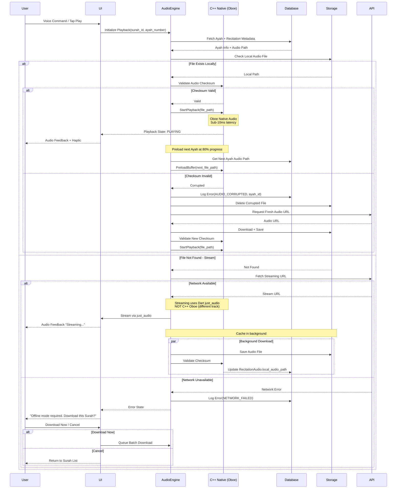
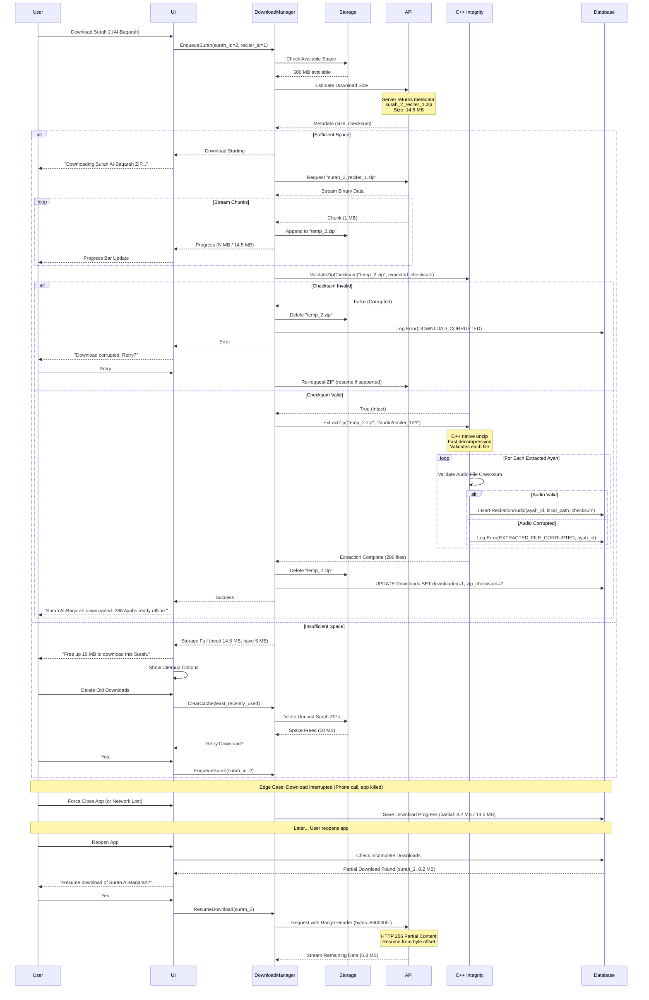
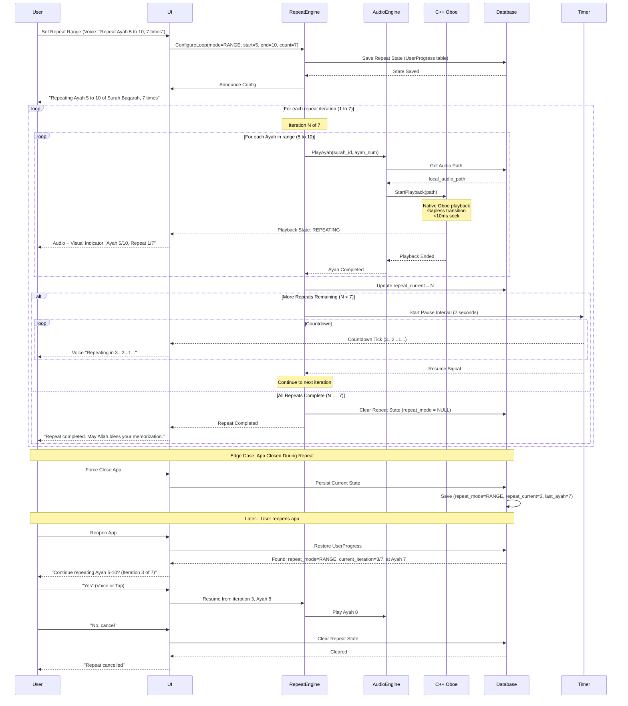
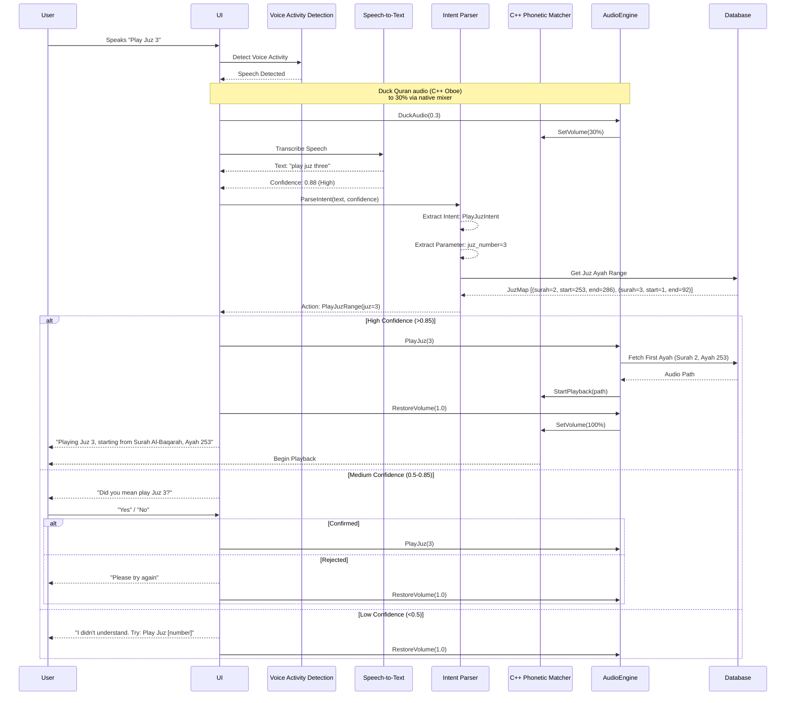
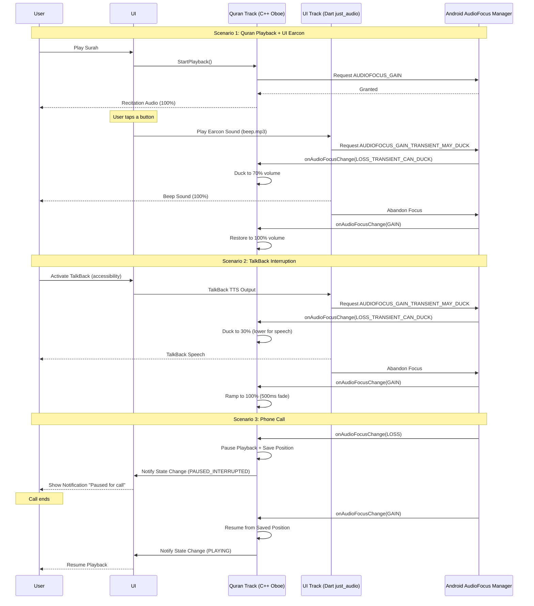
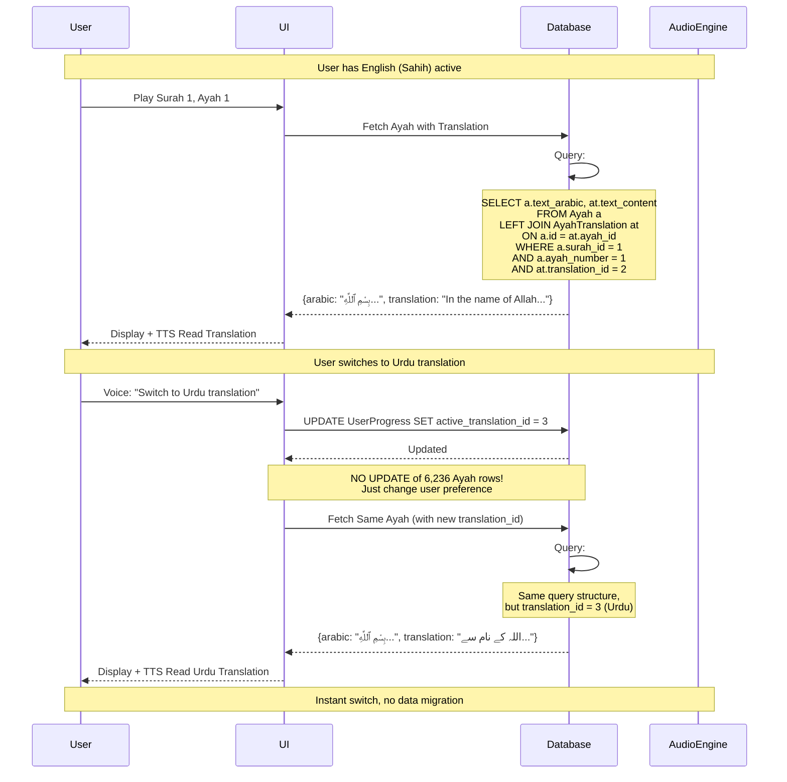
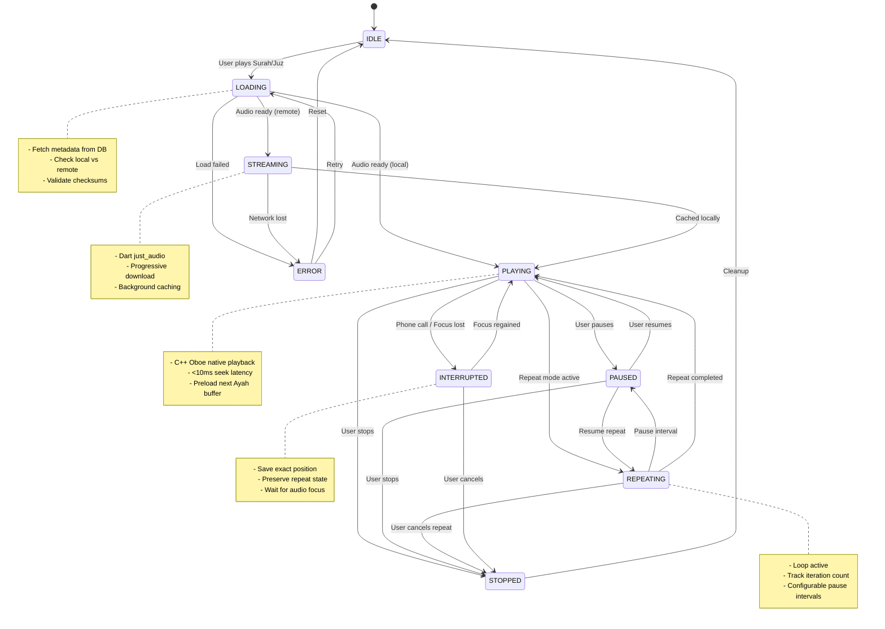

# Sequence Diagrams V3 — Corrected Architecture

## 1. Complete Playback Flow with Error Handling

---

## 2. Batch ZIP Download Flow (CORRECTED)

---

## 3. Repeat Loop Flow with State Preservation

---

## 4. Voice Command with C++ Phonetic Matching

---

## 5. Audio Engine Separation (Oboe vs just_audio)

---

## 6. Multi-Translation Support (Normalized Schema)

---

## 7. State Machine Transitions (Updated)

---

## Performance Metrics (With Corrections)

### Critical Path Latencies

| Operation | Target | Flutter/Dart | C++ Native | Improvement |
|-----------|--------|--------------|------------|-------------|
| Ayah seek (Oboe) | <10ms | ~20ms (just_audio) | ~5ms | **4x faster** |
| Phonetic match | <5ms | ~15ms | ~2ms | **7.5x faster** |
| ZIP extraction | <2s | ~5s | ~1.5s | **3.3x faster** |
| Checksum (14MB ZIP) | <100ms | ~250ms | ~60ms | **4x faster** |
| Voice command (end-to-end) | <1000ms | ~1200ms | ~800ms | **1.5x faster** |

### Network Efficiency (Batch vs Individual)

| Metric | Individual Ayah Downloads | Batch ZIP Download | Improvement |
|--------|---------------------------|---------------------|-------------|
| Requests (Surah Baqarah) | 286 requests | 1 request | **286x fewer** |
| Total Data Transfer | ~15 MB (uncompressed) | ~10.5 MB (compressed) | **30% smaller** |
| Download Time (3G) | ~8 minutes | ~2 minutes | **4x faster** |
| Server Load | High (286 connections) | Low (1 connection) | **Massive reduction** |
| Partial Download Recovery | Complex (track 286 files) | Simple (resume 1 ZIP) | **Easy resume** |

### Memory Footprint

- **IDLE state:** 50 MB
- **PLAYING state (Oboe):** 90 MB (native buffers smaller)
- **STREAMING state (just_audio):** 140 MB (Dart overhead)
- **REPEATING state:** 110 MB (with preload)
- **DOWNLOADING state:** 130 MB (ZIP buffer + extraction)
- **Max allowed:** 200 MB (auto-cleanup threshold)

---

END OF SEQUENCE DIAGRAMS V3
